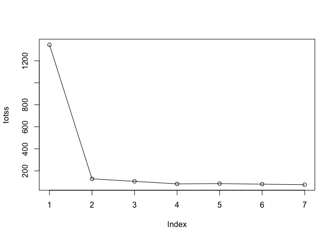

Class 7: Machine Learning 1
================
Challana Tea

In this class, we will explore and get practice with clustering and
Principle Component Analysis (PCA)

\#Clustering with K-means

First we will make up some data to cluster where we know what the result
should be.

``` r
hist(rnorm(300000, mean=-3))
```


I want a little vector with two groupings in it:

``` r
tmp <- c(rnorm(30, -3), rnorm(30, +3))
x <- data.frame(x=tmp, y=rev(tmp))
head(x)
```

              x        y
    1 -3.901009 2.832638
    2 -2.322049 4.146645
    3 -3.126161 3.233992
    4 -4.522565 3.331432
    5 -3.536586 2.256975
    6 -2.659181 5.030142

Let’s have a look:

``` r
plot(x)
```


``` r
km <- kmeans(x, centers = 2)
km
```

    K-means clustering with 2 clusters of sizes 30, 30

    Cluster means:
              x         y
    1 -3.284575  3.086466
    2  3.086466 -3.284575

    Clustering vector:
     [1] 1 1 1 1 1 1 1 1 1 1 1 1 1 1 1 1 1 1 1 1 1 1 1 1 1 1 1 1 1 1 2 2 2 2 2 2 2 2
    [39] 2 2 2 2 2 2 2 2 2 2 2 2 2 2 2 2 2 2 2 2 2 2

    Within cluster sum of squares by cluster:
    [1] 63.64562 63.64562
     (between_SS / total_SS =  90.5 %)

    Available components:

    [1] "cluster"      "centers"      "totss"        "withinss"     "tot.withinss"
    [6] "betweenss"    "size"         "iter"         "ifault"      

It is important to not just run the analysis but to be able to get your
important results back in a way that we can do things with them.

> Q. How do I find the cluster sizes

``` r
km$size
```

    [1] 30 30

> Q. How about the cluster centers?

``` r
km$centers
```

              x         y
    1 -3.284575  3.086466
    2  3.086466 -3.284575

> Q. How about the main result - the cluster assignment vector?

``` r
km$cluster
```

     [1] 1 1 1 1 1 1 1 1 1 1 1 1 1 1 1 1 1 1 1 1 1 1 1 1 1 1 1 1 1 1 2 2 2 2 2 2 2 2
    [39] 2 2 2 2 2 2 2 2 2 2 2 2 2 2 2 2 2 2 2 2 2 2

> Q. Can we make a summary figure showing our clustering result? - The
> points colored by cluster assignment and maybe add the cluster centers
> as a different color?

``` r
plot(x, col=c("red", "blue"))
```


``` r
plot(x, col=km$cluster)
```


I need 3 things: data, aes, geoms

``` r
library(ggplot2)
ggplot(x) +
  aes(x,y) +
  geom_point(col=km$cl)
```


``` r
# Make up a color vector
mycols <- rep("gray", 60)
mycols
```

     [1] "gray" "gray" "gray" "gray" "gray" "gray" "gray" "gray" "gray" "gray"
    [11] "gray" "gray" "gray" "gray" "gray" "gray" "gray" "gray" "gray" "gray"
    [21] "gray" "gray" "gray" "gray" "gray" "gray" "gray" "gray" "gray" "gray"
    [31] "gray" "gray" "gray" "gray" "gray" "gray" "gray" "gray" "gray" "gray"
    [41] "gray" "gray" "gray" "gray" "gray" "gray" "gray" "gray" "gray" "gray"
    [51] "gray" "gray" "gray" "gray" "gray" "gray" "gray" "gray" "gray" "gray"

``` r
plot(x, col=mycols)
```


Let’s highlight points 10, 12 and 20

``` r
mycols[c(10,12,20)] <- "red"
plot(x, col=mycols)
```


Play with different numbers and centers

``` r
km <- kmeans(x, centers=3)
plot(x, col=km$cluster)
```


``` r
km$tot.withinss
```

    [1] 112.6679

What we want to do is try out different numbers of K from 1 to 7. We can
write a `for` loop to do this for us and store the `$tot.withinss` each
time.

``` r
totss <- NULL
k <- 1:7

for(i in k) {
  totss <- c(totss,kmeans(x, centers=i)$tot.withinss)
}
```

``` r
plot(totss, typ="o")
```



\#Hierarchical Clustering

We can not just give the `hclust()` function of input data `x` like we
did for the `kmeans()`.

We need to first calculate a “distance matrix”. The `dist()` function by
default will calculate euclidean distance.

``` r
d <- dist(x)
hc <- hclust(d)
hc
```


    Call:
    hclust(d = d)

    Cluster method   : complete 
    Distance         : euclidean 
    Number of objects: 60 

The print out is not very helpful, but the plot method is useful

``` r
plot(hc)
abline(h=10, col="red", lty=2)
```


To get my all important cluster membership vector out of a hclust object
I can use the `cutree()`

``` r
cutree(hc,h=10)
```

     [1] 1 1 1 1 1 1 1 1 1 1 1 1 1 1 1 1 1 1 1 1 1 1 1 1 1 1 1 1 1 1 2 2 2 2 2 2 2 2
    [39] 2 2 2 2 2 2 2 2 2 2 2 2 2 2 2 2 2 2 2 2 2 2

You can also set a `k=` argument to `cutree()`

``` r
grps <- cutree(hc, k=2)
```

``` r
plot(x, col=grps)
```


