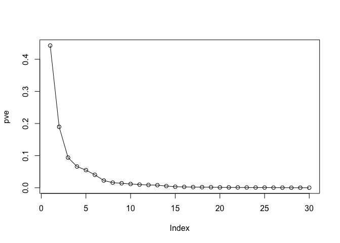
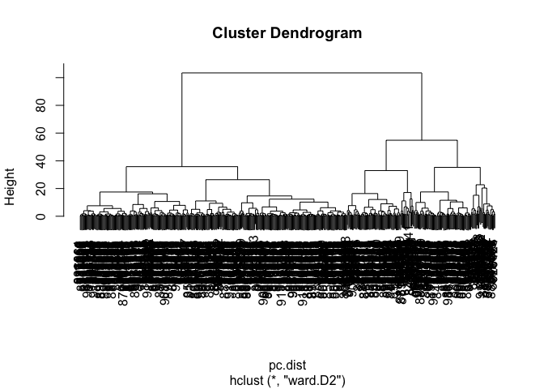

Class 8
================
Challana Tea

# Import the dataset

Before we can begin our analysis we first have to download and import
the data correctly into our R session. Use read.csv()

``` r
wisc.df <- read.csv("Wisconsincancer.csv",row.names=1)
head(wisc.df)
```

             diagnosis radius_mean texture_mean perimeter_mean area_mean
    842302           M       17.99        10.38         122.80    1001.0
    842517           M       20.57        17.77         132.90    1326.0
    84300903         M       19.69        21.25         130.00    1203.0
    84348301         M       11.42        20.38          77.58     386.1
    84358402         M       20.29        14.34         135.10    1297.0
    843786           M       12.45        15.70          82.57     477.1
             smoothness_mean compactness_mean concavity_mean concave.points_mean
    842302           0.11840          0.27760         0.3001             0.14710
    842517           0.08474          0.07864         0.0869             0.07017
    84300903         0.10960          0.15990         0.1974             0.12790
    84348301         0.14250          0.28390         0.2414             0.10520
    84358402         0.10030          0.13280         0.1980             0.10430
    843786           0.12780          0.17000         0.1578             0.08089
             symmetry_mean fractal_dimension_mean radius_se texture_se perimeter_se
    842302          0.2419                0.07871    1.0950     0.9053        8.589
    842517          0.1812                0.05667    0.5435     0.7339        3.398
    84300903        0.2069                0.05999    0.7456     0.7869        4.585
    84348301        0.2597                0.09744    0.4956     1.1560        3.445
    84358402        0.1809                0.05883    0.7572     0.7813        5.438
    843786          0.2087                0.07613    0.3345     0.8902        2.217
             area_se smoothness_se compactness_se concavity_se concave.points_se
    842302    153.40      0.006399        0.04904      0.05373           0.01587
    842517     74.08      0.005225        0.01308      0.01860           0.01340
    84300903   94.03      0.006150        0.04006      0.03832           0.02058
    84348301   27.23      0.009110        0.07458      0.05661           0.01867
    84358402   94.44      0.011490        0.02461      0.05688           0.01885
    843786     27.19      0.007510        0.03345      0.03672           0.01137
             symmetry_se fractal_dimension_se radius_worst texture_worst
    842302       0.03003             0.006193        25.38         17.33
    842517       0.01389             0.003532        24.99         23.41
    84300903     0.02250             0.004571        23.57         25.53
    84348301     0.05963             0.009208        14.91         26.50
    84358402     0.01756             0.005115        22.54         16.67
    843786       0.02165             0.005082        15.47         23.75
             perimeter_worst area_worst smoothness_worst compactness_worst
    842302            184.60     2019.0           0.1622            0.6656
    842517            158.80     1956.0           0.1238            0.1866
    84300903          152.50     1709.0           0.1444            0.4245
    84348301           98.87      567.7           0.2098            0.8663
    84358402          152.20     1575.0           0.1374            0.2050
    843786            103.40      741.6           0.1791            0.5249
             concavity_worst concave.points_worst symmetry_worst
    842302            0.7119               0.2654         0.4601
    842517            0.2416               0.1860         0.2750
    84300903          0.4504               0.2430         0.3613
    84348301          0.6869               0.2575         0.6638
    84358402          0.4000               0.1625         0.2364
    843786            0.5355               0.1741         0.3985
             fractal_dimension_worst  X
    842302                   0.11890 NA
    842517                   0.08902 NA
    84300903                 0.08758 NA
    84348301                 0.17300 NA
    84358402                 0.07678 NA
    843786                   0.12440 NA

> Q1. How many samples and variables are in this dataset?

``` r
nrow(wisc.df)
```

    [1] 569

``` r
ncol(wisc.df)
```

    [1] 32

> Q2. How many M and B samples are there?

``` r
sum(wisc.df$diagnosis=="M")
```

    [1] 212

``` r
sum(wisc.df$diagnosis=="B")
```

    [1] 357

``` r
table(wisc.df$diagnosis)
```


      B   M 
    357 212 

> Q3. How many variables/features in the data are suffixed with \_mean?

``` r
length(grep("_mean",colnames(wisc.df)))
```

    [1] 10

> Q. What features are “mean” values (or have “mean” in their name)

``` r
(grep("_mean",colnames(wisc.df), value=TRUE))
```

     [1] "radius_mean"            "texture_mean"           "perimeter_mean"        
     [4] "area_mean"              "smoothness_mean"        "compactness_mean"      
     [7] "concavity_mean"         "concave.points_mean"    "symmetry_mean"         
    [10] "fractal_dimension_mean"

I need to remove the first diagnosis column from the data before doing
any analysis. I will store it for later as a factor

``` r
# We can use -1 here to remove the first column
wisc.data <- wisc.df[,-1]
diagnosis <- as.factor(wisc.df$diagnosis)
```

# 2. Principal Component Analysis

The main PCA function in base R is called `prcom()`.

Before doing anything like PCA, it is important to check if the data
need to be scaled before performing PCA. Recall two common reasons for
scaling data include:

- The input variables use different units of measurement.
- The input variables have significantly different variances.

Looks like we need to scale by setting `scale=TRUE` in our `prcomp()`
function call.

``` r
round(apply(wisc.data, 2, sd), 2)
```

                radius_mean            texture_mean          perimeter_mean 
                       3.52                    4.30                   24.30 
                  area_mean         smoothness_mean        compactness_mean 
                     351.91                    0.01                    0.05 
             concavity_mean     concave.points_mean           symmetry_mean 
                       0.08                    0.04                    0.03 
     fractal_dimension_mean               radius_se              texture_se 
                       0.01                    0.28                    0.55 
               perimeter_se                 area_se           smoothness_se 
                       2.02                   45.49                    0.00 
             compactness_se            concavity_se       concave.points_se 
                       0.02                    0.03                    0.01 
                symmetry_se    fractal_dimension_se            radius_worst 
                       0.01                    0.00                    4.83 
              texture_worst         perimeter_worst              area_worst 
                       6.15                   33.60                  569.36 
           smoothness_worst       compactness_worst         concavity_worst 
                       0.02                    0.16                    0.21 
       concave.points_worst          symmetry_worst fractal_dimension_worst 
                       0.07                    0.06                    0.02 
                          X 
                         NA 

``` r
wisc.data <- wisc.df[,-32]
```

``` r
wisc.data <- wisc.data[,-1]
```

## Time for PCA

``` r
wisc.pr <- prcomp(wisc.data, scale=TRUE)
summary(wisc.pr)
```

    Importance of components:
                              PC1    PC2     PC3     PC4     PC5     PC6     PC7
    Standard deviation     3.6444 2.3857 1.67867 1.40735 1.28403 1.09880 0.82172
    Proportion of Variance 0.4427 0.1897 0.09393 0.06602 0.05496 0.04025 0.02251
    Cumulative Proportion  0.4427 0.6324 0.72636 0.79239 0.84734 0.88759 0.91010
                               PC8    PC9    PC10   PC11    PC12    PC13    PC14
    Standard deviation     0.69037 0.6457 0.59219 0.5421 0.51104 0.49128 0.39624
    Proportion of Variance 0.01589 0.0139 0.01169 0.0098 0.00871 0.00805 0.00523
    Cumulative Proportion  0.92598 0.9399 0.95157 0.9614 0.97007 0.97812 0.98335
                              PC15    PC16    PC17    PC18    PC19    PC20   PC21
    Standard deviation     0.30681 0.28260 0.24372 0.22939 0.22244 0.17652 0.1731
    Proportion of Variance 0.00314 0.00266 0.00198 0.00175 0.00165 0.00104 0.0010
    Cumulative Proportion  0.98649 0.98915 0.99113 0.99288 0.99453 0.99557 0.9966
                              PC22    PC23   PC24    PC25    PC26    PC27    PC28
    Standard deviation     0.16565 0.15602 0.1344 0.12442 0.09043 0.08307 0.03987
    Proportion of Variance 0.00091 0.00081 0.0006 0.00052 0.00027 0.00023 0.00005
    Cumulative Proportion  0.99749 0.99830 0.9989 0.99942 0.99969 0.99992 0.99997
                              PC29    PC30
    Standard deviation     0.02736 0.01153
    Proportion of Variance 0.00002 0.00000
    Cumulative Proportion  1.00000 1.00000

> Q4. From your results, what proportion of the original variance is
> captured by the first principal components (PC1)?

44.27

> Q5. How many principal components (PCs) are required to describe at
> least 70% of the original variance in the data?

PC3

> Q6. How many principal components (PCs) are required to describe at
> least 90% of the original variance in the data?

PC7

``` r
biplot(wisc.pr)
```


> Q7. What stands out to you about this plot? Is it easy or difficult to
> understand? Why?

This plot is incredibly messy and very difficult to make out any clear
observations.

``` r
attributes(wisc.pr)
```

    $names
    [1] "sdev"     "rotation" "center"   "scale"    "x"       

    $class
    [1] "prcomp"

Make a little scree plot

``` r
pr.var <- wisc.pr$sdev^2
#Proportion of variance
pve <- pr.var/sum(pr.var)

plot(pve, typ="o")
```



PC plot

``` r
library(ggplot2)
pc <- as.data.frame(wisc.pr$x)

ggplot(pc) +
  aes(x=PC1,y=PC2,col=diagnosis) +
  geom_point()
```


# Hierarchical clustering

We can try clustering the original data with `hclust()` or `kmeans()`.
First we will scale the data just like we did for PCA

``` r
data.scaled <- scale(wisc.data)
head(apply(data.scaled,2,sd))
```

         radius_mean     texture_mean   perimeter_mean        area_mean 
                   1                1                1                1 
     smoothness_mean compactness_mean 
                   1                1 

``` r
data.dist <- dist(data.scaled)
wisc.hclust <- hclust(data.dist, method = "complete")
wisc.hclust
```


    Call:
    hclust(d = data.dist, method = "complete")

    Cluster method   : complete 
    Distance         : euclidean 
    Number of objects: 569 

Plot the dendogram

``` r
plot(wisc.hclust)
abline(h=19, col="red", lty=2)
```


To get a cluster membership vector I will use the `cutree()` function
and “cut” into 4 or so grps or clusters.

> Q10. Using the plot() and abline() functions, what is the height at
> which the clustering model has 4 clusters?

h = 19

``` r
grps <- cutree(wisc.hclust, h=19)
table(grps)
```

    grps
      1   2   3   4 
    177   7 383   2 

I can also use the `table()` to cross tabulate…

``` r
table(diagnosis)
```

    diagnosis
      B   M 
    357 212 

``` r
table(grps,diagnosis)
```

        diagnosis
    grps   B   M
       1  12 165
       2   2   5
       3 343  40
       4   0   2

# Clustering on PCA Results

I can cluster in PC-space and use as many or as few PCs as I want.

To start with I will use 3 PCs, that is I will cluster along PC1, PC2,
and PC3.

``` r
pc.dist <- dist(wisc.pr$x[,1:3])
wisc.pr.hclust <- hclust(pc.dist, method="ward.D2")
plot(wisc.pr.hclust)
```



This looks nicer than the previous clustering result. Find the two major
clusters with the `cutree()` function

``` r
grps <- cutree(wisc.pr.hclust, k=2)
table(grps)
```

    grps
      1   2 
    203 366 

``` r
table(grps, diagnosis)
```

        diagnosis
    grps   B   M
       1  24 179
       2 333  33

We could calculate accuracy - the proportion of samples correct if we
take cluster 1 to represent all M and cluster 2 to represent all B.

``` r
(179+333)/nrow(wisc.data)
```

    [1] 0.8998243

# Prediction

``` r
url <- "https://tinyurl.com/new-samples-CSV"
new <- read.csv(url)
npc <- predict(wisc.pr, newdata=new)
npc
```

               PC1       PC2        PC3        PC4       PC5        PC6        PC7
    [1,]  2.576616 -3.135913  1.3990492 -0.7631950  2.781648 -0.8150185 -0.3959098
    [2,] -4.754928 -3.009033 -0.1660946 -0.6052952 -1.140698 -1.2189945  0.8193031
                PC8       PC9       PC10      PC11      PC12      PC13     PC14
    [1,] -0.2307350 0.1029569 -0.9272861 0.3411457  0.375921 0.1610764 1.187882
    [2,] -0.3307423 0.5281896 -0.4855301 0.7173233 -1.185917 0.5893856 0.303029
              PC15       PC16        PC17        PC18        PC19       PC20
    [1,] 0.3216974 -0.1743616 -0.07875393 -0.11207028 -0.08802955 -0.2495216
    [2,] 0.1299153  0.1448061 -0.40509706  0.06565549  0.25591230 -0.4289500
               PC21       PC22       PC23       PC24        PC25         PC26
    [1,]  0.1228233 0.09358453 0.08347651  0.1223396  0.02124121  0.078884581
    [2,] -0.1224776 0.01732146 0.06316631 -0.2338618 -0.20755948 -0.009833238
                 PC27        PC28         PC29         PC30
    [1,]  0.220199544 -0.02946023 -0.015620933  0.005269029
    [2,] -0.001134152  0.09638361  0.002795349 -0.019015820

``` r
plot(wisc.pr$x[,1:2], col=grps)
points(npc[,1], npc[,2], col="blue", pch=16, cex=3)
text(npc[,1], npc[,2], c(1,2), col="white")
```


> Q16. Which of these new patients should we prioritize for follow up
> based on your results?

Patient 2 should be prioritized.
