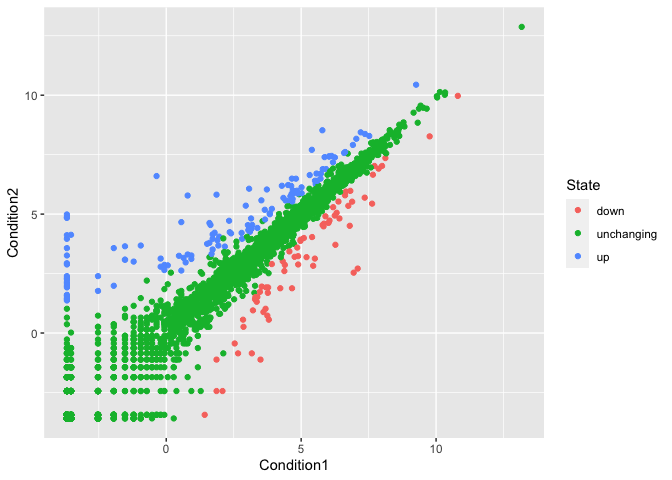
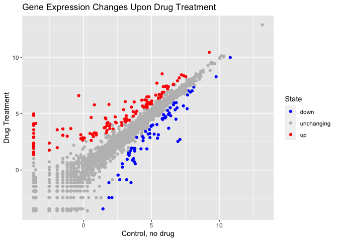
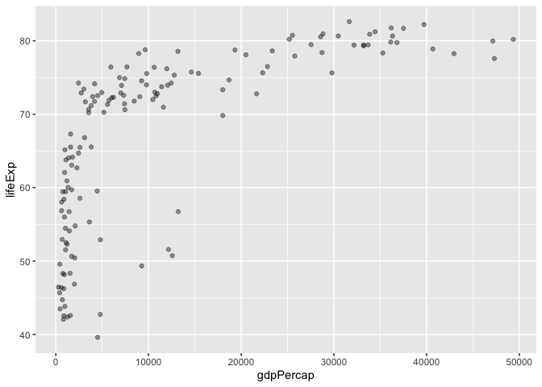
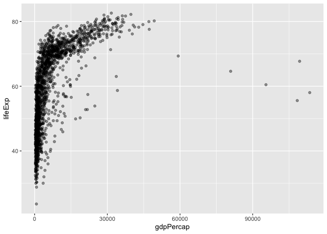
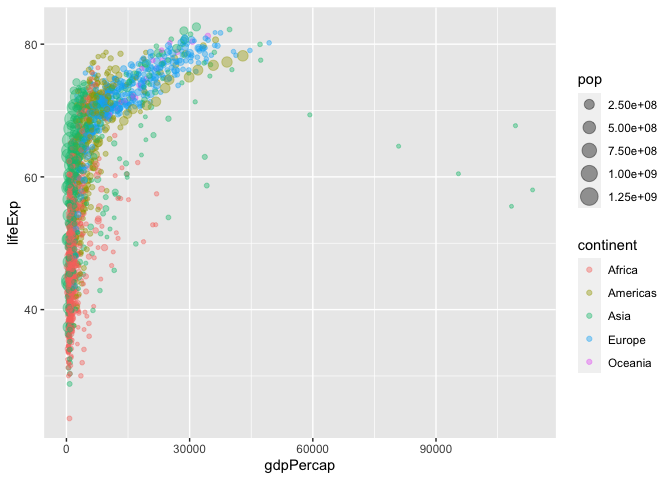
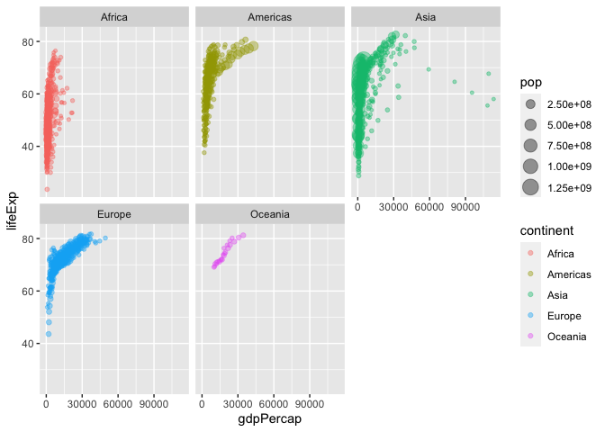

Class 05: Data Visualization with GGPLOT
================
Challana Tea

### R Plotting

The following utilizes “base” R visualization

``` r
head(cars, n=10)
```

       speed dist
    1      4    2
    2      4   10
    3      7    4
    4      7   22
    5      8   16
    6      9   10
    7     10   18
    8     10   26
    9     10   34
    10    11   17

``` r
plot(cars)
```


ggplot is helpful for more complex plots and visualization, but will
first need to be installed through install.packages.

``` r
library(ggplot2)
ggplot(cars)
```


Three layers to each ggplot: \* data (df) \* aesthetics (aes) \*
geometrics (geom_type)

``` r
ggplot(cars) +
  aes(x=speed, y=dist) +
  geom_point() +
  geom_smooth(method='lm', se = FALSE) +
  theme_bw()
```

    `geom_smooth()` using formula = 'y ~ x'


### Plotting DEG Analysis

``` r
url <- "https://bioboot.github.io/bimm143_S20/class-material/up_down_expression.txt"
genes <- read.delim(url)
head(genes)
```

            Gene Condition1 Condition2      State
    1      A4GNT -3.6808610 -3.4401355 unchanging
    2       AAAS  4.5479580  4.3864126 unchanging
    3      AASDH  3.7190695  3.4787276 unchanging
    4       AATF  5.0784720  5.0151916 unchanging
    5       AATK  0.4711421  0.5598642 unchanging
    6 AB015752.4 -3.6808610 -3.5921390 unchanging

How many genes? –\> 5196 How many upregulated –\> 127

``` r
nrow(genes)
```

    [1] 5196

``` r
table(genes$State)
```


          down unchanging         up 
            72       4997        127 

``` r
sum(genes$State == 'up')
```

    [1] 127

``` r
ggplot(genes) +
  aes(x = Condition1, y = Condition2) +
  geom_point()
```


``` r
p <- ggplot(genes) +
  aes(x=Condition1, y=Condition2, col=State) +
  geom_point()

p
```



To change the legend colors and axes titles of p

``` r
p + scale_colour_manual( values=c("blue","gray","red") ) +
  labs(title = "Gene Expression Changes Upon Drug Treatment",
       x = "Control, no drug", y = "Drug Treatment")
```



### Gapminder

Plot GDP per capita against life expectancy from gapminder dataset

``` r
library(gapminder)
library(dplyr)
```


    Attaching package: 'dplyr'

    The following objects are masked from 'package:stats':

        filter, lag

    The following objects are masked from 'package:base':

        intersect, setdiff, setequal, union

``` r
gapminder_2007 <- gapminder %>% filter(year==2007)

ggplot(gapminder_2007) +
  aes(x=gdpPercap, y=lifeExp) +
  geom_point(alpha = 0.4)
```



How many countries are in this dataset? –\> 142 How many years? –\> 12

``` r
length(unique(gapminder$country))
```

    [1] 142

``` r
length(unique(gapminder$year))
```

    [1] 12

``` r
range(gapminder$year)
```

    [1] 1952 2007

Smallest population? Which country?

``` r
ind <- which.min(gapminder$pop)
ind
```

    [1] 1297

``` r
gapminder$country[ind]
```

    [1] Sao Tome and Principe
    142 Levels: Afghanistan Albania Algeria Angola Argentina Australia ... Zimbabwe

``` r
gapminder[ind,]
```

    # A tibble: 1 × 6
      country               continent  year lifeExp   pop gdpPercap
      <fct>                 <fct>     <int>   <dbl> <int>     <dbl>
    1 Sao Tome and Principe Africa     1952    46.5 60011      880.

``` r
ggplot(gapminder) +
  aes(x=gdpPercap, y=lifeExp) +
  geom_point(alpha = 0.4)
```



``` r
ggplot(gapminder) +
  aes(x=gdpPercap, y=lifeExp, color=continent, size=pop) +
  geom_point(alpha=0.4)
```



Splitting by continent

``` r
ggplot(gapminder) +
  aes(x=gdpPercap, y=lifeExp, color=continent, size=pop) +
  geom_point(alpha=0.4) +
  facet_wrap(~continent)
```


